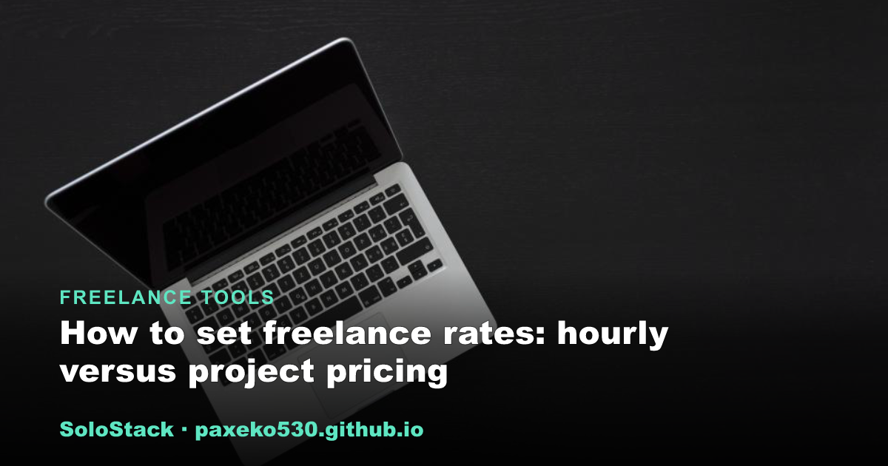

<h1 align="center">SoloStack</h1>

<strong>Practical guides for people who work for themselves.</strong> 
Straight-talking guides on the tools, gear, and setups that make independent work run smoothly.

&nbsp;

---

## Browse by topic

<table><tr>
<td width="33%" valign="top">  <strong><a href="https://paxeko530.github.io/category-freelancer.html">Freelance Tools</a></strong> Software, cash flow, contracts, invoicing</td>
<td width="33%" valign="top">  <strong><a href="https://paxeko530.github.io/category-escritorio.html">Home Office</a></strong> Ergonomics, lighting, remote-work productivity</td>
<td width="33%" valign="top">  <strong><a href="https://paxeko530.github.io/category-ia.html">Self-Hosting &amp; Local AI</a></strong> Home servers, NAS, mini PCs, open-source models</td>
</tr></table>

## Latest guides

- **[How to choose a NAS for home backups and file storage](https://paxeko530.github.io/posts/choose-a-nas-for-home-backups.html)** &nbsp;Self-Hosting & Local AI
- **[Choosing a monitor arm to reclaim desk space](https://paxeko530.github.io/posts/choosing-a-monitor-arm.html)** &nbsp;Home Office
- **[A beginner guide to Docker for self-hosting](https://paxeko530.github.io/posts/docker-for-self-hosting-beginners.html)** &nbsp;Self-Hosting & Local AI
- **[How to set freelance rates: hourly versus project pricing](https://paxeko530.github.io/posts/how-to-set-freelance-rates.html)** &nbsp;Freelance Tools
- **[Using a local LLM as a coding assistant in your editor](https://paxeko530.github.io/posts/local-llm-coding-assistant.html)** &nbsp;Self-Hosting & Local AI
- **[Building a low-power home server with a mini PC](https://paxeko530.github.io/posts/low-power-home-server-mini-pc.html)** &nbsp;Self-Hosting & Local AI
- **[Raspberry Pi versus a mini PC for self-hosting](https://paxeko530.github.io/posts/raspberry-pi-vs-mini-pc-self-hosting.html)** &nbsp;Self-Hosting & Local AI
- **[Adding fast SSD storage to a home server](https://paxeko530.github.io/posts/ssd-storage-for-a-home-server.html)** &nbsp;Self-Hosting & Local AI
- **[Do you need a UPS for your home server?](https://paxeko530.github.io/posts/ups-for-a-home-server.html)** &nbsp;Self-Hosting & Local AI
- **[Building an ergonomic desk setup at home on a budget](https://paxeko530.github.io/posts/affordable-ergonomic-desk-setup.html)** &nbsp;Home Office
- **[The best invoicing apps for freelancers in 2026](https://paxeko530.github.io/posts/best-invoicing-apps-for-freelancers.html)** &nbsp;Freelance Tools
- **[How to choose the right local LLM for each task](https://paxeko530.github.io/posts/choosing-the-right-local-llm-for-the-task.html)** &nbsp;Self-Hosting & Local AI

<a href="https://paxeko530.github.io/"><strong>See all &rarr;</strong></a>

## What to expect

- Every guide opens with an on-page outline and closes with an FAQ.
- Some guides recommend gear; the pick is chosen for fit rather than commission, and
  the page says so. Guides without a recommendation stay product-free.

---

<a href="https://paxeko530.github.io/about.html">About</a> &nbsp;&middot;&nbsp;
<a href="https://paxeko530.github.io/how-we-choose.html">How we choose</a> &nbsp;&middot;&nbsp;
<a href="https://paxeko530.github.io/disclosure.html">Affiliate disclosure</a> &nbsp;&middot;&nbsp;
<a href="https://paxeko530.github.io/feed.xml">RSS</a>

